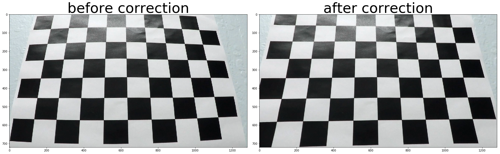
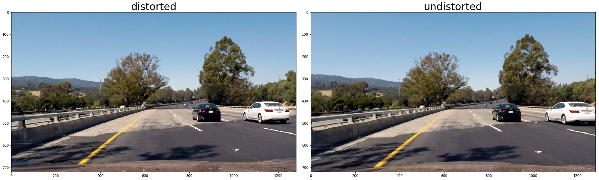
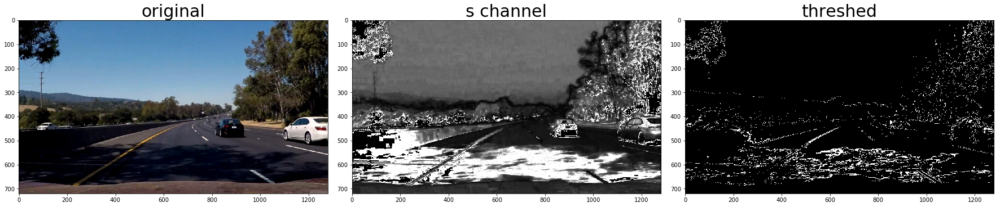
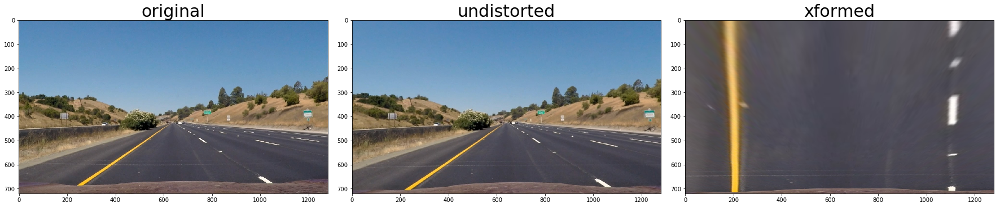
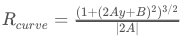
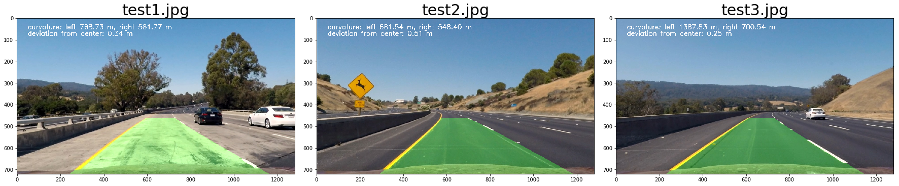
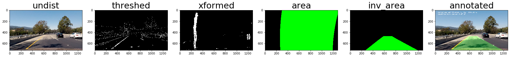
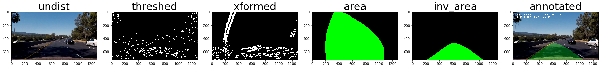

**Advanced Lane Finding Project**

The goals / steps of this project are the following:

* Compute the camera calibration matrix and distortion coefficients given a set of chessboard images.
* Apply a distortion correction to raw images.
* Use color transforms, gradients, etc., to create a thresholded binary image.
* Apply a perspective transform to rectify binary image ("birds-eye view").
* Detect lane pixels and fit to find the lane boundary.
* Determine the curvature of the lane and vehicle position with respect to center.
* Warp the detected lane boundaries back onto the original image.
* Output visual display of the lane boundaries and numerical estimation of lane curvature and vehicle position.

## [Rubric](https://review.udacity.com/#!/rubrics/571/view) Points
### Here I will consider the rubric points individually and describe how I addressed each point in my implementation.  

---
### Writeup / README

#### 1. Provide a Writeup / README that includes all the rubric points and how you addressed each one.  You can submit your writeup as markdown or pdf.

You're reading this writeup.

### Camera Calibration

#### 1. Briefly state how you computed the camera matrix and distortion coefficients. Provide an example of a distortion corrected calibration image.

The code for this step is in Jupyter notebook section "Camera Calibration." The general steps are preparing arguments to pass into `cv2.calibrateCamera`

 1. for all chessboards, use openCV `findChessboardCorners` to get `corners`, i.e. points on 2D plane.
 2. `objpoints` is (x, y, z) positions in 3D world. In our case, z is 0, and `x` and `y` can be simply passed in `(0,0)`, `(1, 0)`, ..., `(5, 8)` for each set of `corners`.
 3. passing `objpoints` and all corresponding `corners` to `calibrateCamera` to get camera matrix and distortion coefficients.

Here is an example of restoring distorted image (it is also in Jupyter Book under section "Correct Image Distortion.")



### Pipeline (single images)

#### 1. Provide an example of a distortion-corrected image.
Here is an example of correction of distorted image



#### 2. Describe how (and identify where in your code) you used color transforms, gradients or other methods to create a thresholded binary image.  Provide an example of a binary image result.

there are various functions for thresholding colors and gradients in the Jupyter book, under title "Create Thresholded Binary Image."

I used a combination of color and gradient thresholds to generate a binary image.

I transform the image from RGB to HLS color space and take its `S` channel as one of many sources of the final binary image. See function `rgb_to_s_channel`.

I also threshold images by its gradient magnitude, gradient directions and derivative along `x` axis and `y` axis.

Here's an example of threshed images.



#### 3. Describe how (and identify where in your code) you performed a perspective transform and provide an example of a transformed image.

Perspective transformation is done in class `PerspectiveXform`. The code is in Jupyter notebook section "Perspective Transform."

I selected source points as

```
(550, 464)  --- (730,  464)
|                  |
|                  |
(0, height) --- (1280, height)
```

Destination is the four corners of an image of the same size of the original one. It is hard coded, because the camera position is known.

Finally I verified that the source and destination worked as expected by eyeballing a perspective transformation done on an image containing a straight lane; the warped image appeared to have two parallel lines. I visualized the image below:



#### 4. Describe how (and identify where in your code) you identified lane-line pixels and fit their positions with a polynomial?

To identify lane-line pixels, I used the sliding window techniques given in the lecture: split the perspective-transformed lane line vertically into 9 windows, and find lane line pixels in each of these windows. After getting pixels, I used `polyfit` function to fit these pixels with a polynomial.

The code is in section "Finding the Lanes and Fit a Polynomial."

#### 5. Describe how (and identify where in your code) you calculated the radius of curvature of the lane and the position of the vehicle with respect to center.

After getting parameters of two polynomials (left line and right line) `f(y) = A*y^2 + B*y + C`, I calculate `f1(y)` and `f2(y)` using `y = 720`, the height of the image. The deviation of vehicle is the deviation of the middle of the image and middle of `(f1(720)+f2(720))/2`

Calculation the radius of curvature using the following formula



where `A` and `B` is what we've gotten in Polynomial. `y` is calculated using the height of the image, which stands for where the camera is.

These calculated numbers are in pixels, and finally it's turned into estimated meters.

#### 6. Provide an example image of your result plotted back down onto the road such that the lane area is identified clearly.

I implemented `AnnotateLane` function in section "All together: Annotate Images."" Here is an example of annotated images:



Here are images visualized inside each stage of the processing pipeline.



---

### Pipeline (video)

#### 1. Provide a link to your final video output.  Your pipeline should perform reasonably well on the entire project video (wobbly lines are ok but no catastrophic failures that would cause the car to drive off the road!).

Here's the [link to the anotated value](./annotated_project_video.mp4)

---

### Discussion

#### 1. Briefly discuss any problems / issues you faced in your implementation of this project.  Where will your pipeline likely fail?  What could you do to make it more robust?

I didn't optimize the sliding window algorithm. Since it's computation intensive, my implementation is not fast enough for real time lane detection.

Perspective transformation currently is tightly coupled with camera position, and the region of interest is unfortunately hard coded. I can imagine this algorithm would have difficulty to recognize sharp turns and lanes on a big slope.

Color transformation could have problems because I used only S channel. S channel is actually bad at highlighting lanes in the shadow. Take this example:



Introducing another channel (maybe the L channel) may partially solve this problem (Current implementation amortized the outliers using a frame buffer). Again I think using one channel is not enough to highlight lines in different conditions.

Another problem is that I manually tuned all the parameters. The process is slow, inefficient, and not be able to produce optimal parameters. To improve it, I would think of some automated process to do parameter tuning.
